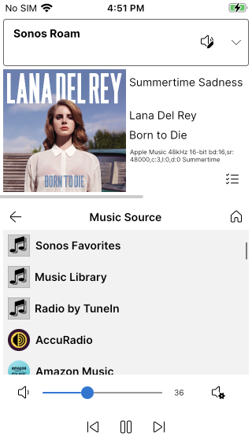

# OpenPhonos
OpenPhonos is full featured Sonos stack and application, in C#, that runs on almost any device.

This codebase has been around in various forms for well over a decade, starting on Windows Phone 7, then 7.5, then 8, then Windows 8, then UWP, then iOS and most recently run on TvOs, Android and MacOS.
Everything is written in C#, and the sample app uses the Avalonia framework to run on pretty much anything.

It is compatible with all S1 and S2 devices, running firmware all the way back to the 8.4 release.

This code uses the UPnP APIs in the speakers, and SMAPI to talk to music services. The newer [Sonos cloud api](https://docs.sonos.com/docs/control-sonos-players) has no support in this project at this time.

Almost everything has been reverse engineered: the only official documentation is the [UPnP Specification](https://openconnectivity.org/developer/specifications/upnp-resources/upnp/), and the [Sonos Music API](https://docs.sonos.com/docs/smapi). 

Parts of this code (or its predecessors) have shipped to hundreds of thousands of users over the years, in products known as *Phonos, Phonos Lite, Phonos Universal*, and *Phonos Plus*. (I'm not very good at marketing, or naming apps, or github projects for that matter).

## How Sonos Works
There is a reasonable overview of how Sonos works on the [Sonos Developer Portal](https://docs.sonos.com/docs/how-sonos-works). It surprises many to learn that a Sonos app is not a music player - is a remote control. It instructs the Sonos devices to play the music.

# Overview of the Code

## [UPnP](UPnP.md)
UPnP is the underpinnings for it all. It's the oldest part of the code because, apart from the Eventing code, it hasn't needed much in the way of changes since it was written. It includes the *UPNPServiceGenerator* which takes the API declarations from a device on your network and generates the code and data structures to call those APIs. It runs on .NET Standard 2.0.

## [Sonos](Sonos.md)
Sonos is the next level up and includes classes to represent the key Sonos objects, such as Zones, Players, Households, Groups, MusicServices and other data sources. It too runs on .NET Standard 2.0.

## [PhonosAvalonia (in Samples)](SampleApp.md) 
This is the included "sample" app that runs on any device that the Avalonia framework supports. It's a full featured Sonos controller, with the ability to play music, control volume, queue actions, group speakers, and browse music service content etc. It runs on .NET8.

## [Music Sources](MusicSources.md) 
Shows how every possible music source is represented and enumerated.

## [Music Services](MusicServices.md)
Shows the details about how Sonos (and this codebase) supports over a hundred music services.

## [Platforms](Platforms.md) 
This details the differences and issues of each supported platform.

## Licence
I am sharing this with the MIT licence. I would appreciate it if you would let me know if you use it, and if you make any improvements, please share them back. 

If you produce any products with this code, all I ask is that you avoid including the word *Phonos* in its name, to avoid confusion with my in-market apps. Also a link to this project in the About page would be appreciated.